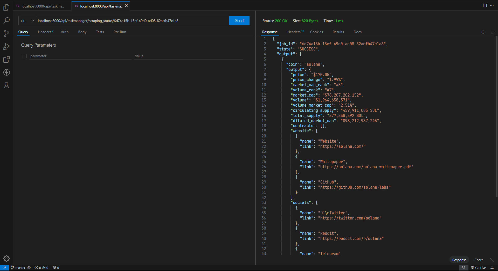

# Coin Scraper

### Step 1: Set up the Django project

1. **Create a new Django project and app:**

```bash
django-admin startproject cryptoapi
cd cryptoapi
django-admin startapp scraper
```

2. **Install the required libraries:**

```bash
pip install django djangorestframework celery requests selenium
```

3. **Add the installed apps to your `INSTALLED_APPS` in `settings.py`:**

```python
# cryptoapi/settings.py

INSTALLED_APPS = [
    ...
    'rest_framework',
    'scraper',
]
```

4. **Configure Celery in `settings.py`:**

```python
# cryptoapi/settings.py

CELERY_BROKER_URL = 'redis://localhost:6379/0'
CELERY_RESULT_BACKEND = 'redis://localhost:6379/0'
```

### Step 2: Set up Celery

1. **Create a `celery.py` file in your project directory:**

```python
# cryptoapi/celery.py

from __future__ import absolute_import, unicode_literals
import os
from celery import Celery

os.environ.setdefault('DJANGO_SETTINGS_MODULE', 'cryptoapi.settings')

app = Celery('cryptoapi')

app.config_from_object('django.conf:settings', namespace='CELERY')

app.autodiscover_tasks()
```

2. **Update the `__init__.py` file to load the Celery app:**

```python
# cryptoapi/__init__.py

from __future__ import absolute_import, unicode_literals

from .celery import app as celery_app

__all__ = ('celery_app',)
```

### Step 3: Create the API endpoint

1. **Define the API view in `views.py`:**

```python
# scraper/views.py

from rest_framework.views import APIView
from rest_framework.response import Response
from .tasks import scrape_crypto_data

class CryptoDataView(APIView):
    def post(self, request):
        coin_list = request.data.get('coins', [])
        task = scrape_crypto_data.delay(coin_list)
        return Response({'task_id': task.id})
```

2. **Create a URL route for the API in `urls.py`:**

```python
# cryptoapi/urls.py

from django.contrib import admin
from django.urls import path
from scraper.views import CryptoDataView

urlpatterns = [
    path('admin/', admin.site.urls),
    path('api/crypto-data/', CryptoDataView.as_view(), name='crypto-data'),
]
```

### Step 4: Implement the Celery task

1. **Define the Celery task in `tasks.py`:**

```python
# scraper/tasks.py

from celery import shared_task
import requests
from selenium import webdriver
from selenium.webdriver.chrome.service import Service
from webdriver_manager.chrome import ChromeDriverManager

@shared_task
def scrape_crypto_data(coin_list):
    driver = webdriver.Chrome(service=Service(ChromeDriverManager().install()))
    results = []

    for coin in coin_list:
        url = f'https://www.example.com/{coin}'  # Replace with actual URL
        driver.get(url)
        
        # Example of scraping data
        price = driver.find_element_by_xpath("//span[@class='price']").text
        results.append({'coin': coin, 'price': price})

    driver.quit()
    return results
```

### Step 5: Running Celery

1. **Start the Celery worker:**

```bash
celery -A cryptoapi worker --loglevel=info
```

### Step 6: Running the Django server

1. **Start the Django development server:**

```bash
python manage.py runserver
```

### README.md

Create a `README.md` file to document the project:

```markdown
# Crypto API

This project provides a REST API to fetch cryptocurrency data.

## Requirements

- Python 3.x
- Django
- Django REST framework
- Celery
- Redis
- Requests
- Selenium
- ChromeDriver

## Setup

1. Install dependencies:

    ```bash
    pip install -r requirements.txt
    ```

2. Configure Celery in `settings.py`:

    ```python
    CELERY_BROKER_URL = 'redis://localhost:6379/0'
    CELERY_RESULT_BACKEND = 'redis://localhost:6379/0'
    ```

3. Start the Redis server:

    ```bash
    redis-server
    ```

4. Start the Celery worker:

    ```bash
    celery -A cryptoapi worker --loglevel=info
    ```

5. Start the Django development server:

    ```bash
    python manage.py runserver
    ```

## API Usage

- **Endpoint**: `/api/crypto-data/`
- **Method**: `POST`
- **Payload**: JSON object with a list of coin acronyms, e.g., `{"coins": ["BTC", "ETH"]}`
- **Response**: JSON object with task ID, e.g., `{"task_id": "some_task_id"}`

## Example

### Request

```bash
curl -X POST http://localhost:8000/api/crypto-data/ -d '{"coins": ["BTC", "ETH"]}' -H "Content-Type: application/json"
```

### Response

```json
{
    "task_id": "some_task_id"
}
```

### Fetching Task Result

```bash
curl -X GET http://localhost:8000/api/crypto-data/some_task_id/
```

### Example Screenshots

1. **Requesting Data**

    

2. **Response with Task ID**

    

3. **Job details**

    

4. **Jobs in admin pannel**

    

5. **Task Result**

    
